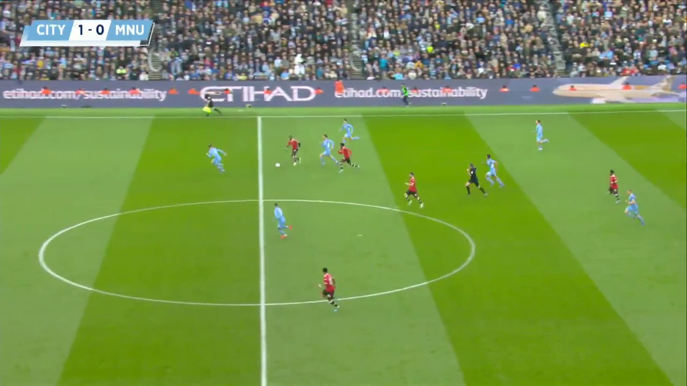
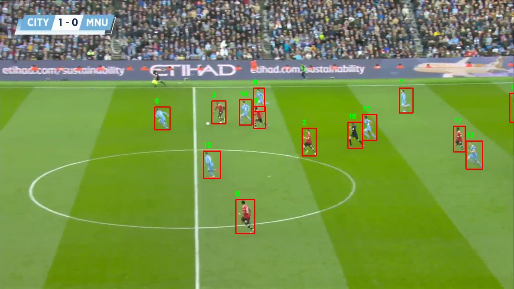
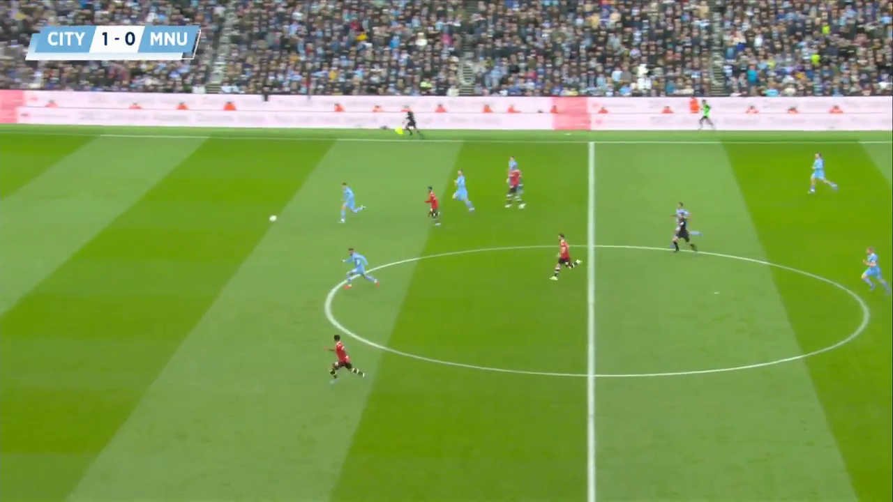
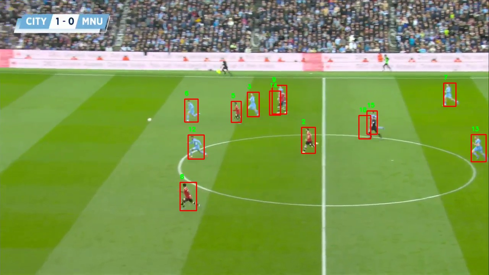
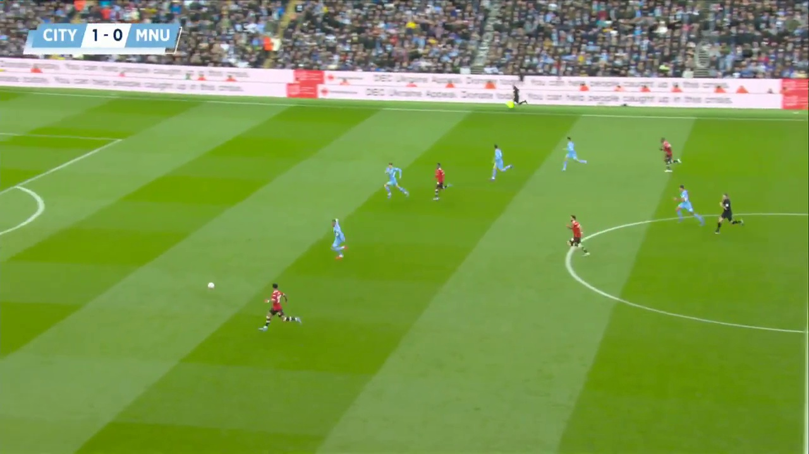
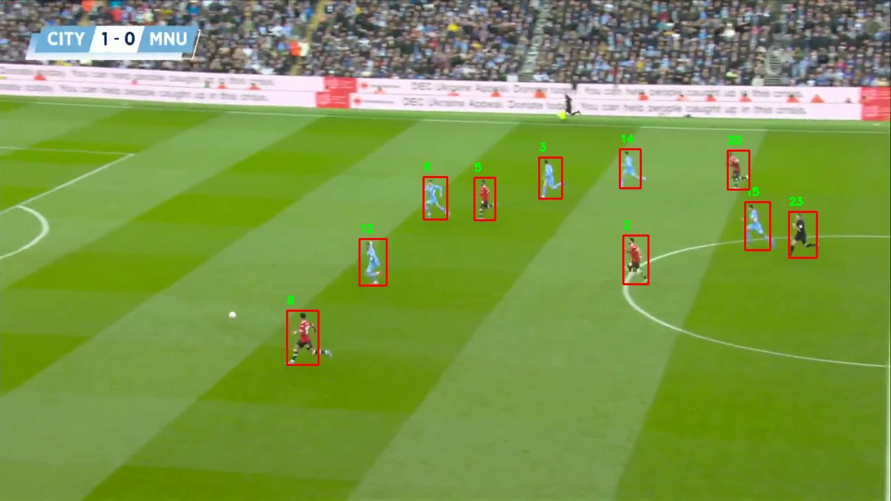

# Football Player Tracking Using YOLOv11

This repository contains an implementation of object tracking using the YOLOv11 (You Only Look Once) model in conjunction with the DeepSORT tracking algorithm. The primary focus of this project is to detect and track football players in video footage.

## Table of Contents

- [Installation](#installation)
- [Training and Testing ](#training)
- [Results](#results)

## Installation

To set up the project, clone this repository and install the required dependencies:

```bash
git clone https://github.com/saeidtaleghani23/YOLO11_Object_Detection.git
cd YOLO11_Object_Detection
pip install -r requirements.txt
```
## Training and Testing
To fine-tune the YOLO11m model and test its performance on the football.mp4, run:
```bash
python track_players_YOLO11.py
```

## Results
The output video containing the detected and tracked objects is saved as output_football.mp4. 
Here are two videos demonstrating the object tracking:
1. **Input Video:** [football.mp4](https://github.com/saeidtaleghani23/YOLO11_Object_Detection/raw/main/football.mp4)

2. **Output Video:** [output_football.mp4](https://github.com/saeidtaleghani23/YOLO11_Object_Detection/raw/main/output_football.mp4)

You can click on the links above to view or download the videos.

Here is some frames of the original video and the output video:

Here are some frames of the original video and the output video:

| Original Frames                   | Output Frames                      |
|-----------------------------------|------------------------------------|
|  |  |
|  |  |
|  |  |
